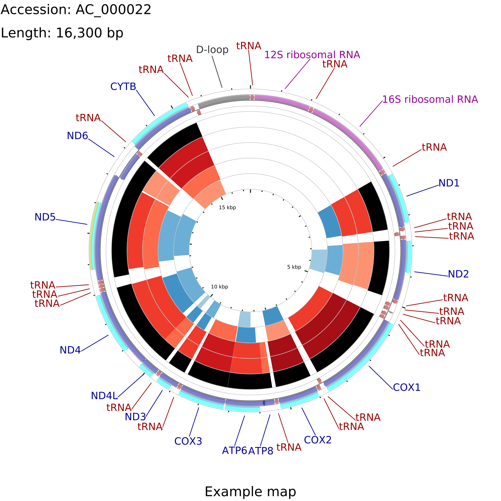
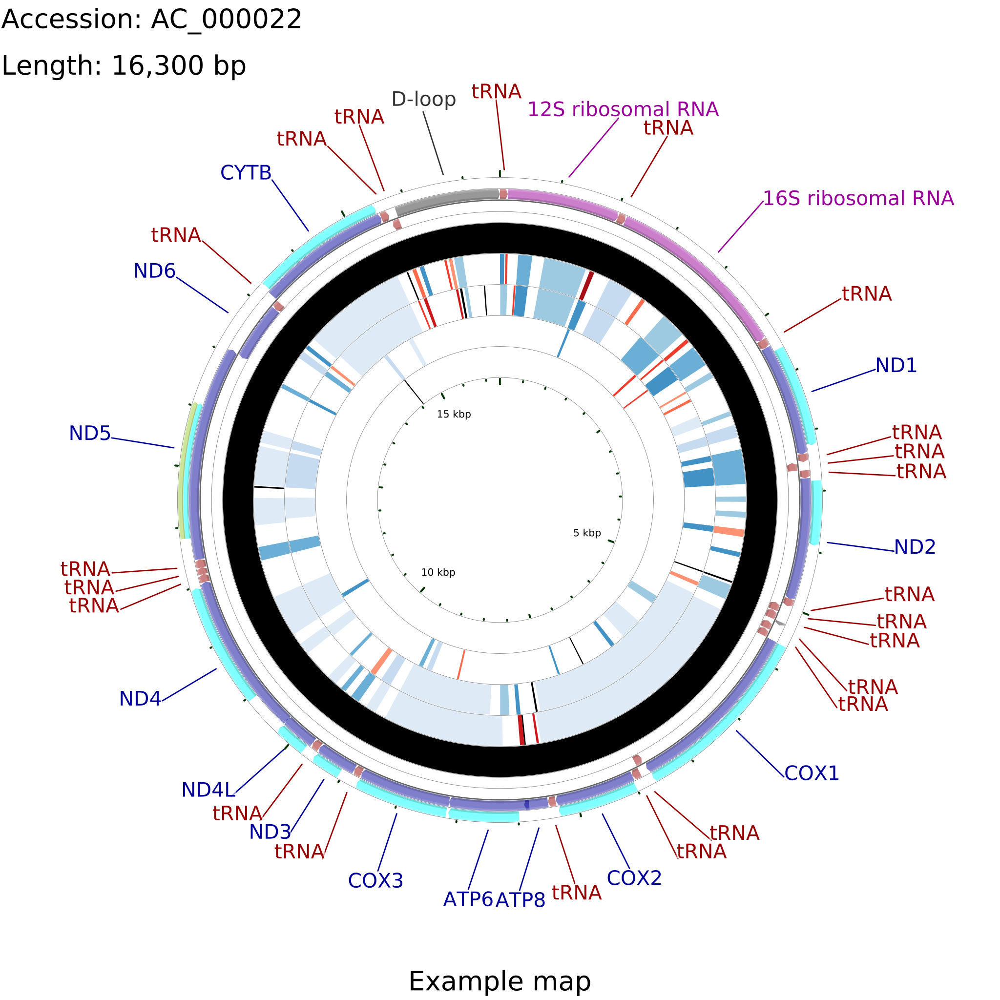

# CGView Comparison Tool (CCT)
The CGView Comparison Tool (CCT) is a package for visually comparing bacterial, plasmid, chloroplast, and mitochondrial sequences. The comparisons are conducted using BLAST, and the BLAST results are presented in the form of graphical maps that can also show sequence features, gene and protein names, COG category assignments, and sequence composition characteristics. CCT can generate maps in a variety of sizes, including 400 Megapixel maps suitable for posters. Comparisons can be conducted within a particular species or genus, or all available genomes can be used. The entire map creation process, from downloading sequences to redrawing zoomed maps, can be completed easily using scripts included with CCT. User-defined features or analysis results can be included on maps, and maps can be extensively customized.

Sample CCT maps can be viewed [here](https://paulstothard.github.io/cgview_comparison_tool/index.html).

CCT was written and is maintained by Paul Stothard <stothard@ualberta.ca> and Jason Grant <jason.grant@ualberta.ca>.

## CCT citation

[Grant JR, Arantes AS, Stothard P (2012) Comparing thousands of circular genomes using the CGView Comparison Tool. BMC Genomics 13:202.](https://pubmed.ncbi.nlm.nih.gov/22621371/)

## Using the CCT Docker image

Pull the Docker image:

```bash
docker pull pstothard/cgview_comparison_tool
```

Run the Docker image and use `fetch_genome_by_accession.sh` to download a sequence in GenBank format:

```bash
docker run --rm -v $(pwd):/dir -w /dir pstothard/cgview_comparison_tool \
fetch_genome_by_accession.sh -a AC_000022 -o ./
```

Use `build_blast_atlas.sh` to create a BLAST Atlas project for the sequence that was downloaded (to simplify this and subsequent commands, `$CCT` is used to store the first part of the command, which runs the Docker image):

```bash
CCT="docker run --rm -v $(pwd):/dir -w /dir pstothard/cgview_comparison_tool"
$CCT build_blast_atlas.sh -i AC_000022.gbk
```

Download some sequences to be used as "comparison genomes" in the BLAST Atlas project:

```bash
$CCT fetch_genome_by_accession.sh -a NC_046914 -o ./AC_000022/comparison_genomes
$CCT fetch_genome_by_accession.sh -a NC_047196 -o ./AC_000022/comparison_genomes
$CCT fetch_genome_by_accession.sh -a NC_047457 -o ./AC_000022/comparison_genomes
$CCT fetch_genome_by_accession.sh -a AC_000022 -o ./AC_000022/comparison_genomes
$CCT fetch_genome_by_accession.sh -a NC_001326 -o ./AC_000022/comparison_genomes
$CCT fetch_genome_by_accession.sh -a NC_043914 -o ./AC_000022/comparison_genomes
```

Generate the CGView maps:

```bash
$CCT build_blast_atlas.sh -p AC_000022 -z medium
```

Once complete, the maps can be found in the `AC_000022/maps_for_cds_vs_cds` and `AC_000022/maps_for_dna_vs_dna` directories on the host system.

There are multiple ways to alter the appearance and contents of a map generated by CCT. For example, the [configuration files](https://paulstothard.github.io/cgview_comparison_tool/creating_maps.html#controlling-content) written when a project is first created can be edited prior to completion of the project. Also, [CCT script command-line options](https://paulstothard.github.io/cgview_comparison_tool/commands.html) can be used to alter the contents and appearance of a map. Finally, the [CGView XML file](https://paulstothard.github.io/cgview/xml_overview.html) that is generated as the input to [cgview.jar](https://github.com/paulstothard/cgview) can be edited and [reprocessed](https://paulstothard.github.io/cgview_comparison_tool/commands.html##redraw_maps). For more details see the [CCT documentation](https://paulstothard.github.io/cgview_comparison_tool/index.html), in particular the [tutorials](https://paulstothard.github.io/cgview_comparison_tool/tutorials.html).

For example, the following command uses the [--custom option](https://paulstothard.github.io/cgview_comparison_tool/customization_keys.html) to change several aspects of the map:

```bash
$CCT build_blast_atlas.sh -p AC_000022 -x -z medium --custom "title='Example map' global_label=T legend=F use_opacity=F backboneRadius=900 labelFontSize=60 borderColor=white width=3000 height=3000"
```

This command redraws the maps in SVG format:

```bash
$CCT redraw_maps.sh -p AC_000022 -f svg
```

The SVG maps are added to the `AC_000022/maps_for_cds_vs_cds` and `AC_000022/maps_for_dna_vs_dna` directories. Below are the maps generated for the CDS vs CDS comparisons and the DNA vs DNA comparisons, respectively.




### Tip

When using the CCT Docker image to run commands described in the [CCT documentation](https://paulstothard.github.io/cgview_comparison_tool/index.html), you can store the Docker portion of the command in an environment variable, for example:

```bash
CCT="docker run --rm -v $(pwd):/dir -w /dir pstothard/cgview_comparison_tool"
```

Then the commands in the CCT documentation can be run by preceding them with the environment variable, for example:

```bash
$CCT fetch_genome_by_accession.sh -a NC_009787 -o ./
$CCT build_blast_atlas.sh -i NC_009787.gbk
```

## Downloading and running CCT

To download CCT:

```bash
git clone git@github.com:paulstothard/cgview_comparison_tool.git
```

CCT requires the following programs:

* [java](https://openjdk.java.net)
* [blastall](https://ftp.ncbi.nlm.nih.gov/blast/executables/legacy.NOTSUPPORTED/)
* [formatdb](https://ftp.ncbi.nlm.nih.gov/blast/executables/legacy.NOTSUPPORTED/)
* [convert](https://imagemagick.org/)
* [montage](https://imagemagick.org/)

CCT requires the following Perl modules:

* Tie::IxHash
* Bio::SeqIO
* Bio::SeqUtils
* File::Temp
* Bio::Tools::CodonTable
* LWP::Protocol::https

Set the following environment variables (by editing `~/.bashrc` or `~/.bash_profile`, for example):

```bash
export CCT_HOME='/path/to/cgview_comparison_tool'
export PATH=$PATH:${CCT_HOME}/scripts
export PERL5LIB=${CCT_HOME}/lib/perl_modules
```

Test your setup:

```bash
check_env.sh
```

Build some test maps:

```bash
process_test_projects.sh
```

Refer to the [CCT documentation](https://paulstothard.github.io/cgview_comparison_tool/index.html) for information on how to use CCT. The [tutorials](https://paulstothard.github.io/cgview_comparison_tool/tutorials.html) are a good starting point.
